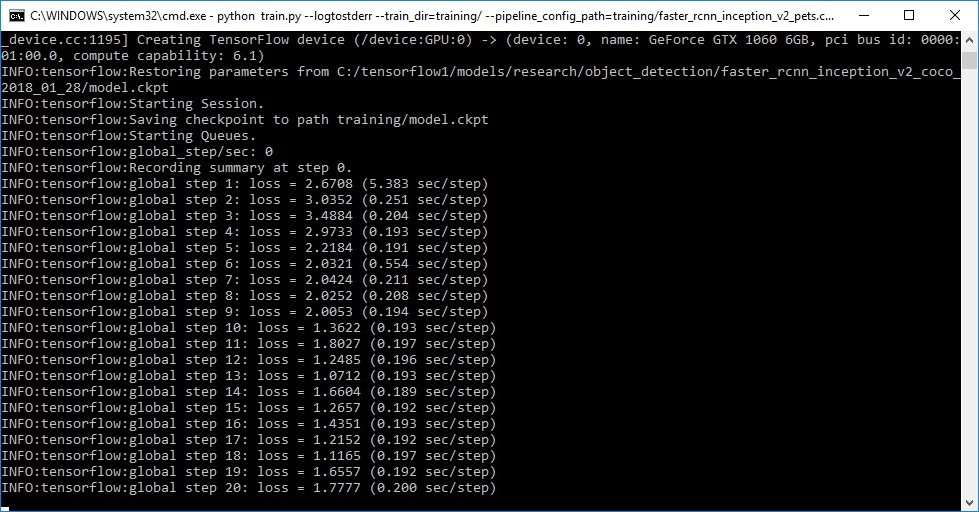

# *Learning By Doing*

# Hello World of Object Detection Classifier for Multiple Objects Using TensorFlow on Ubuntu

*For Hello World example, we will give a image to the Deep Learning, in result our inference will tell which card it is. Here we are taking only 6 cards only.*
<p align="center">
  
</p>

## Basic 3 steps of Deep Learning
1. Collecting Data
2. Marking the Data
3. Starting the training

* one time Setting up the machine:*

## Detail Steps of Deep Learning with TensorFlow
1. Loading the data:
2. Marking the data:
3. Dividing the Data
4. Concerting the Marked XML to CSV
5. CSV to record Files
6. Setting the training model
7. Creating the config file
8. Start The training
9. Creating Inferences
10. Monitoring the training
11. Checking the output results


## For hello world:
Hearby for the hello 
 world example we will skip some steps, because I have already collected the data with markings. This will make use reach fast over first itration as its hello world for tensorflow. This will help you to get basic understanding of tensorflow. If you are looking for second level details please commit for that and if you have any kind of query please comment for it.

### 1. Setting up the machine:

```
# if python3 and pip3 are not installed

sudo apt-get install python3
sudo apt-get install python3-pip

# if git is not installed

sudo apt-get install git

# installing tensorflow
pip3 install tensorflow

# installing other supporting libs, there libs will be user by TF or other supporting steps

sudo apt-get install protobuf-compiler python3-pil python-lxml python-tk
pip3 install Cython
pip3 install jupyter
pip3 install matplotlib
pip3 install pillow
pip3 install lxml
pip3 install pandas
pip3 install opencv-python
pip3 install pandas

# cloning the tensorflow, coco and marked data set for our hello world

mkdir tf_demo_project
cd tf_demo_projects
git clone https://github.com/tensorflow/models.git
git clone https://github.com/cocodataset/cocoapi.git
git clone https://github.com/rahullahoria/tensorflow-object-detection-hello-world-with-example.git

# downloading the faster rcnn model and untaring it

wget http://download.tensorflow.org/models/object_detection/faster_rcnn_inception_v2_coco_2018_01_28.tar.gz
tar -xvzf faster_rcnn_inception_v2_coco_2018_01_28.tar.gz


cd cocoapi/PythonAPI
make #python3 setup.py build_ext --inplace t  rb
cp -r pycocotools ../../models/research/


# From tensorflow/models/research/
cd ../../models/research/
protoc object_detection/protos/*.proto --python_out=.
python3 setup.py build
sudo python3 setup.py install

# From tensorflow/models/research/
export PYTHONPATH=$PYTHONPATH:`pwd`:`pwd`/slim

Testing the installation
python3 object_detection/builders/model_builder_test.py
```


### 2. Loading the data:
Then, generate the TFRecord files by issuing these commands from the /object_detection folder:
```
cd object_detection
cp -r ../../../tensorflow-object-detection-hello-world-with-example/* ./
python3 generate_tfrecord.py --csv_input=images/train_labels.csv --image_dir=images/train --output_path=train.record
python3 generate_tfrecord.py --csv_input=images/test_labels.csv --image_dir=images/test --output_path=test.record
```

```
by https://github.com/tensorflow/models/issues/3705#issuecomment-375563179

you will have this issue please fix it as following

I believe it is the same Python3 incompatibility that has crept up before (see #3443 ). The issue is with models/research/object_detection/utils/learning_schedules.py lines 167-169. Currently it is

rate_index = tf.reduce_max(tf.where(tf.greater_equal(global_step, boundaries),
                                      range(num_boundaries),
                                      [0] * num_boundaries))
Wrap list() around the range() like this:

rate_index = tf.reduce_max(tf.where(tf.greater_equal(global_step, boundaries),
                                     list(range(num_boundaries)),
                                      [0] * num_boundaries))
and you should be good to go. Mine is off and training.


```

### 3. Start The training

Here we go! From the /object_detection directory, issue the following command to begin training:
```
cp ../../../faster_rcnn_inception_v2_coco_2018_01_28 ./
python train.py --logtostderr --train_dir=training --pipeline_config_path=training/faster_rcnn_inception_v2_pets.config
```
If everything has been set up correctly, TensorFlow will initialize the training. The initialization can take up to 30 seconds before the actual training begins. When training begins, it will look like this:

<p align="center">
  
</p>


### 4. Monitoring the training
You can view the progress of the training job by using TensorBoard. 
```
# inside object_detection directory
tensorboard --logdir=training
```
This will create a webpage on your local machine at YourPCName:6006, which can be viewed through a web browser. The TensorBoard page provides information and graphs that show how the training is progressing. One important graph is the Loss graph, which shows the overall loss of the classifier over time.

### 5. Export Inference Graph
Now that training is complete, the last step is to generate the frozen inference graph (.pb file). From the \object_detection folder, issue the following command, where “XXXX” in “model.ckpt-XXXX” should be replaced with the highest-numbered .ckpt file in the training folder:
```
python3 export_inference_graph.py --input_type image_tensor --pipeline_config_path training/faster_rcnn_inception_v2_pets.config --trained_checkpoint_prefix training/model.ckpt-XXXX --output_directory inference_graph
```
This creates a frozen_inference_graph.pb file in the \object_detection\inference_graph folder. The .pb file contains the object detection classifier.

### 6. Checking the output results
Here we go! From the /object_detection directory, issue the following command to begin training:
```
python3 Object_detection_image.py
```


# *Learning By Doing*
